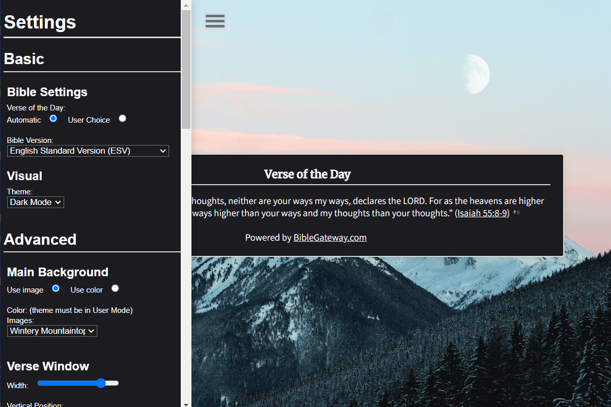

# Bible Verse Vista   
 

  The Bible Verse Vista is a highly customizable Google Chrome extension for displaying Bible verses on new browser tabs. The customization options will include the background image/color, verse window location, Bible version, and the verses themselves. The default browser will be Google Chrome, but other commonly used browsers will be available for users to choose from. The background of the new tab will be minimalistic by default with a light or dark mode. However, users will be able to choose one of the supplied background images. (User uploaded images will be coming the next major update.) Users will be able to choose which Bible version they would prefer, selecting from the choices available on Bible Gateway. Also from Bible Gateway, there will be their default "Verse of the Day." The appearance of the verse window will also be customizable to the user, including custom color and font options. They can also choose from preset locations for the verse window to be on the screen, allowing users to adapt it according to whatever background image they choose and their own personal preference.

## List of Customizable Features
- Automatic or Manual/User Choice Verse of the Day
- Bible Version (and Language)
- Light Mode, Dark Mode, or User Mode (free choice)
- Background Image or Color
- - (default images limited, user image uploading will be the next feature!)
- Verse Window Background Image or Color
- Verse Window Background Opacity
- Verse Window Position and Width
- Verse Window Border Color, Size/Thickness, and Opacity
- Verse Header Show/Hide
- Verse Header Color, Font, and Font Size
- Verse Header Underline Color and Opacity
- Verse Text Color, Font, and Font Size
- Settings Page Color and Opacity
- Settings Header Color, Font, and Font Size
- Settings Label Color, Font, and Font Size
- Save and Load User Settings
- Return to Defaults

## How to Add to Chrome for Yourself

  All you need to do in order to use this for yourself - independent from the Chrome Web Store - is to:
  1) On the right side above all the folders, press the green "<> Code" button.
  2) Go to the bottom of the drop-down and press "Download ZIP". This will download the entire contents of the folder as a ZIP archive to your computer.
  3) Once downloaded, go to where it was saved. Right-click on the ZIP file and select "Extract All" (Windows) or double-click the ZIP file to extract its contents (Mac).
  4) After extracting the ZIP file, you will have a folder containing all the files and subfolders from the GitHub repository. However, all you need is the "src" folder.
  5) To use the extension locally, go into your Google Chrome browser, click the group of three vertical dots near the top-right of the screen.
  6) Around the middle of the drop-down, press "Extensions" and "Manage Extensions"
  7) At the top-right of this new page, click the "Developer Mode" button. This will allow you to use locally stored code to act as an extension and affect your Chrome browser.
  8) Finally, you click the "Load Unpacked" button, navigate to where you saved, and open it **within** the "src" folder. There you have it!

## Feedback
Of course, feel free to provide any feedback about the extension by opening an issue on GitHub (which can be done at the very top of the page, labelled "Issues"). This is extension's ultimate purpose is to help users choose their own experience that best helps them focus on Christ and His Word, so your input is appreciated! 
