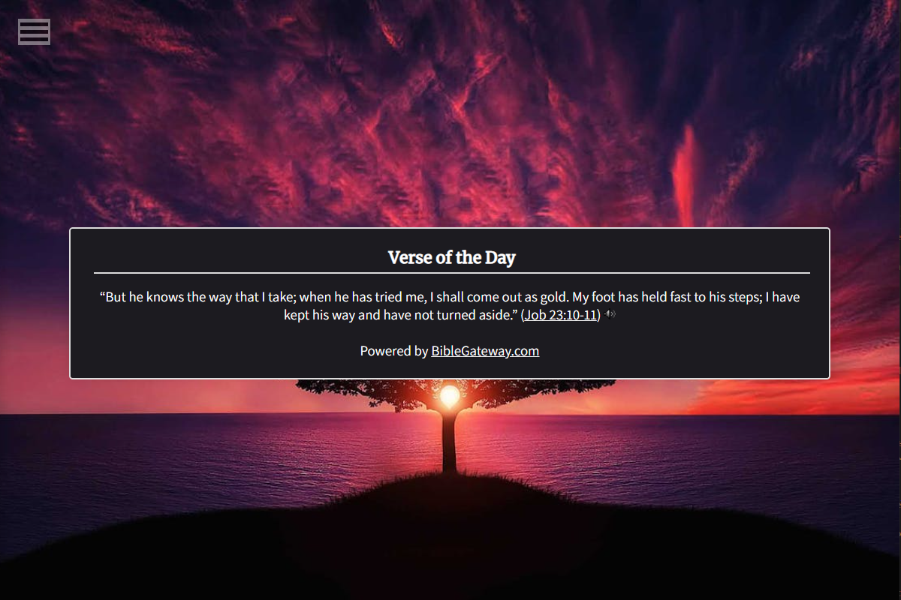

# Bible Verse Vista   

The Bible Verse Vista is a highly customizable Google Chrome extension for displaying Bible verses on new browser tabs. The customization options will include the background image/color, verse window location, Bible version, and the verses themselves. The default browser will be Google Chrome, but other commonly used browsers will be available for users to choose from. The background of the new tab will be minimalistic by default with a light or dark mode. However, users will be able to choose one of the supplied background images. (User uploaded images will be coming the next major update.) Users will be able to choose which Bible version they would prefer, selecting from the choices available on Bible Gateway. Also from Bible Gateway, there will be their default "Verse of the Day." The appearance of the verse window will also be customizable to the user, including custom color and font options. They can also choose from preset locations for the verse window to be on the screen, allowing users to adapt it according to whatever background image they choose and their own personal preference.

## Compile/Deploy

## Usage

## Options

## Testing

