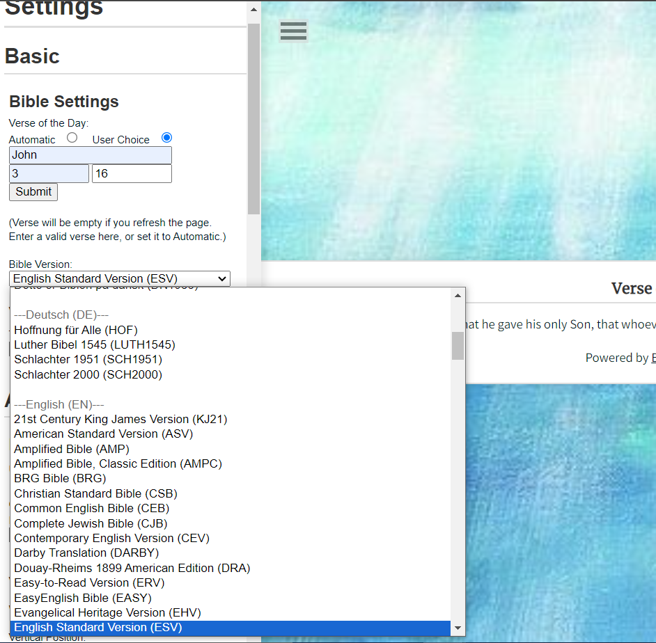
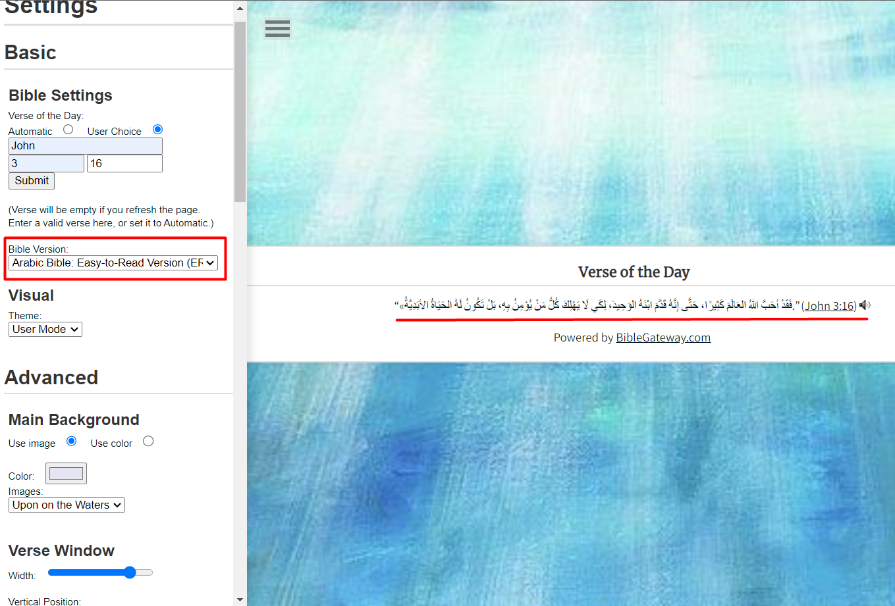
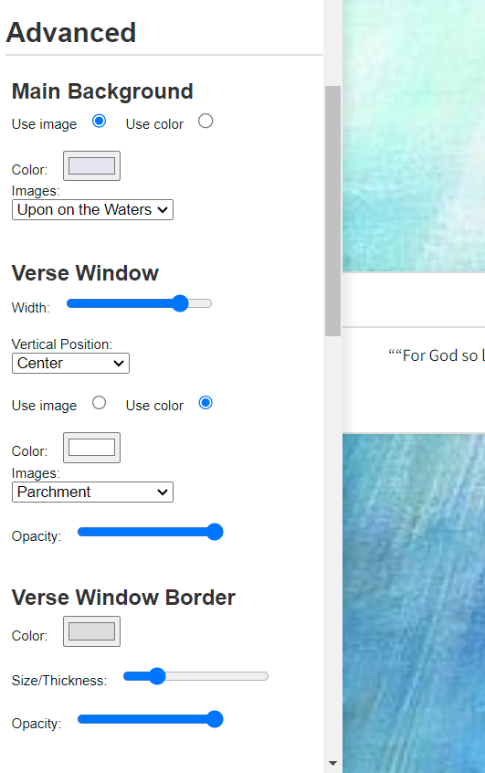
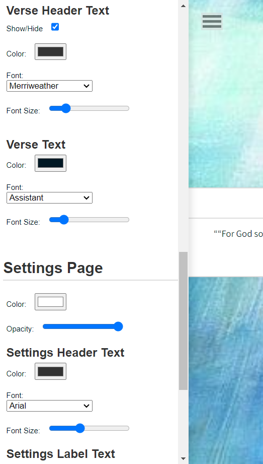
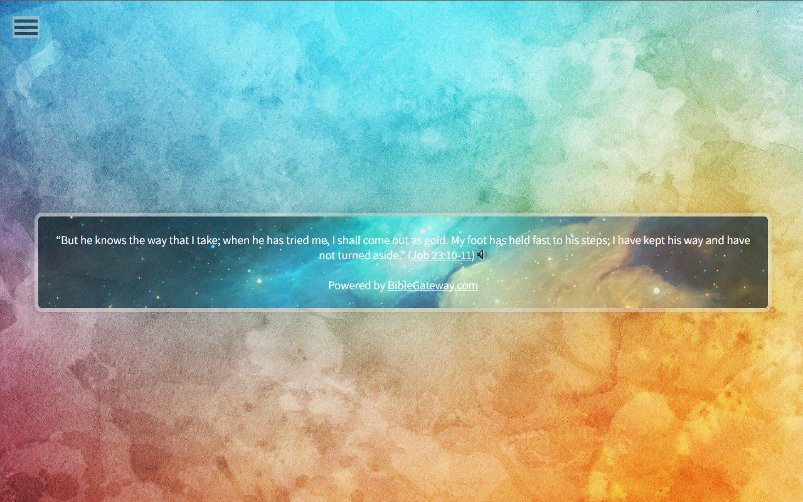
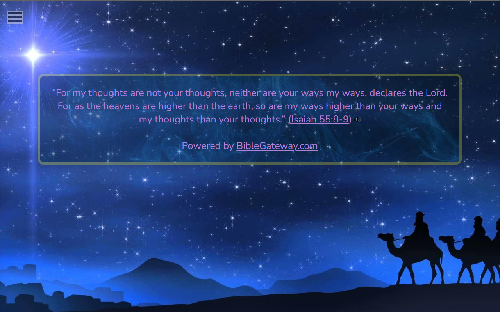
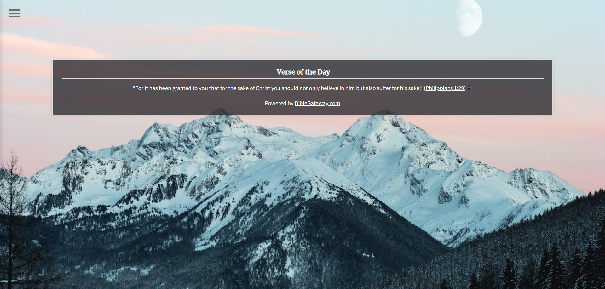
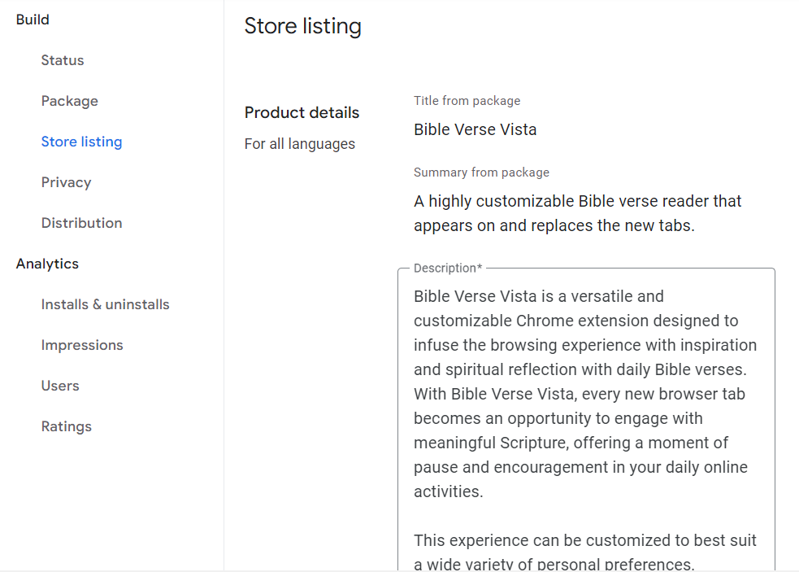
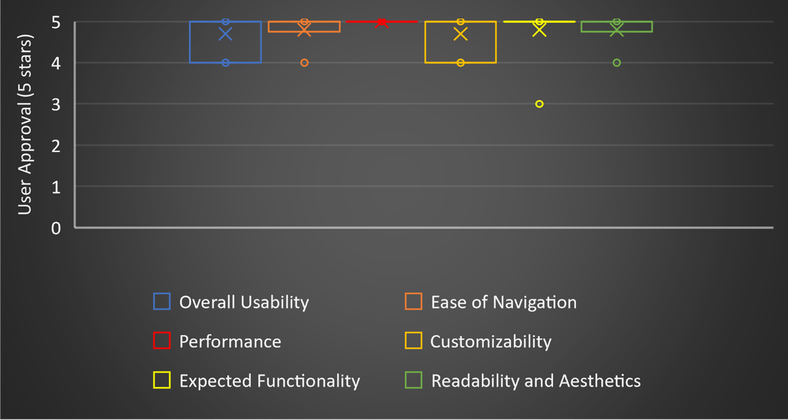
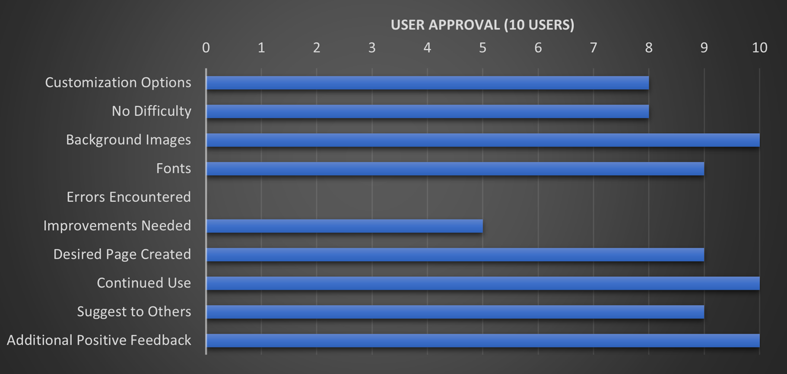

[Back to Main Page](./)

Bible Verse Vista - Defense Documentation
===============
- **Name**: Bryce Furrow
- **Graduation Date**: 5/4/24
- **Majors**: Computer Science and Cybersecurity
- **Advisor**: Dr. Sean Hayes
 

<table>
	<thead>
		<tr>
			<th align="left">
				Table of Contents:
			</th>
		</tr>
	</thead>
	<tbody>
		<tr>
			<td>
				1. <a href="#section1">Statement of Purpose/Problem Statement</a> 
			</td>
		</tr>
		<tr>
			<td>
				2. <a href="#section2">Research and Background</a> 
			</td>
		</tr>
		<tr>
			<td>
				3. <a href="#section3">Project Languages, Software, and Hardware</a> 
			</td>
		</tr>
		<tr>
			<td>
				4. <a href="#section4">Project Requirements</a> 
			</td>
		</tr>
		<tr>
			<td>
				5. <a href="#section5">Project Implementation</a> 
			</td>
		</tr>
		<tr>
			<td>
				6. <a href="#section6">Test Plan</a> 
				&nbsp;&nbsp;&nbsp;&nbsp;6.1 <a href="#section6-1">Introduction</a> 
				&nbsp;&nbsp;&nbsp;&nbsp;&nbsp;&nbsp;&nbsp;&nbsp;6.1.1 <a href="#section6-1-1">Project Overview</a> 
				&nbsp;&nbsp;&nbsp;&nbsp;&nbsp;&nbsp;&nbsp;&nbsp;6.1.2 <a href="#section6-1-2">Goals/Objectives</a> 
				&nbsp;&nbsp;&nbsp;&nbsp;&nbsp;&nbsp;&nbsp;&nbsp;6.1.3 <a href="#section6-1-3">Constraints</a> 
				&nbsp;&nbsp;&nbsp;&nbsp;6.2 <a href="#section6-2">References</a> 
				&nbsp;&nbsp;&nbsp;&nbsp;&nbsp;&nbsp;&nbsp;&nbsp;6.2.1 <a href="#section6-2-1">Project Proposal</a> 
				&nbsp;&nbsp;&nbsp;&nbsp;&nbsp;&nbsp;&nbsp;&nbsp;6.2.2 <a href="#section6-2-2">Project Requirements</a> 
				&nbsp;&nbsp;&nbsp;&nbsp;6.3 <a href="#section6-3">Testing Strategy</a> 
				&nbsp;&nbsp;&nbsp;&nbsp;&nbsp;&nbsp;&nbsp;&nbsp;6.3.1 <a href="#section6-3-1">Test Items</a> 
				&nbsp;&nbsp;&nbsp;&nbsp;&nbsp;&nbsp;&nbsp;&nbsp;6.3.2 <a href="#section6-3-2">Test Features</a> 
				&nbsp;&nbsp;&nbsp;&nbsp;&nbsp;&nbsp;&nbsp;&nbsp;6.3.3 <a href="#section6-3-3">Test Approach</a> 
				&nbsp;&nbsp;&nbsp;&nbsp;&nbsp;&nbsp;&nbsp;&nbsp;&nbsp;&nbsp;&nbsp;&nbsp;6.3.3.1 <a href="#section6-3-3-1">System Test</a> 
				&nbsp;&nbsp;&nbsp;&nbsp;&nbsp;&nbsp;&nbsp;&nbsp;&nbsp;&nbsp;&nbsp;&nbsp;6.3.3.2 <a href="#section6-3-3-2">User Acceptance Test</a> 
				&nbsp;&nbsp;&nbsp;&nbsp;6.4 <a href="#section6-4">Test Deliverables</a> 
				&nbsp;&nbsp;&nbsp;&nbsp;&nbsp;&nbsp;&nbsp;&nbsp;6.4.1 <a href="#section6-4-1">Test Cases</a> 
				&nbsp;&nbsp;&nbsp;&nbsp;&nbsp;&nbsp;&nbsp;&nbsp;6.4.2 <a href="#section6-4-2">Test Results</a> 
				&nbsp;&nbsp;&nbsp;&nbsp;6.5 <a href="#section6-5">Test Environments</a> 
				&nbsp;&nbsp;&nbsp;&nbsp;6.6 <a href="#section6-6">Testing Schedule</a> 
				&nbsp;&nbsp;&nbsp;&nbsp;6.7 <a href="#section6-7">Assumptions and Dependencies</a> 
				&nbsp;&nbsp;&nbsp;&nbsp;&nbsp;&nbsp;&nbsp;&nbsp;6.7.1 <a href="#section6-7-1">Assumptions</a> 
				&nbsp;&nbsp;&nbsp;&nbsp;&nbsp;&nbsp;&nbsp;&nbsp;6.7.2 <a href="#section6-7-2">Dependencies</a> 
				&nbsp;&nbsp;&nbsp;&nbsp;6.8 <a href="#section6-8">Approvals</a> 
			</td>
		</tr>
		<tr>
			<td>
				7. <a href="#section7">Test Results</a> 
				&nbsp;&nbsp;&nbsp;&nbsp;7.1 <a href="#section7-1">Advised Changes</a> 
				&nbsp;&nbsp;&nbsp;&nbsp;7.2 <a href="#section7-2">Test Reports</a> 
			</td>
		</tr>
		<tr>
			<td>
				8. <a href="#section8">Challenges Overcome</a> 
			</td>
		</tr>
		<tr>
			<td>
				9. <a href="#section9">Future Enhancements</a> 
			</td>
		</tr>
		<tr>
			<td>
				10. <a href="#section10">Defense Presentation Slides</a> 
			</td>
		</tr>
	</tbody>
</table>
 

## 1 - Statement of Purpose/Problem Statement 
Today, Christians have the opportunity to deliver the Word in a more effective, convenient, and personalized way with modern technologies, such as Google Chrome extensions. However, the majority of existing Bible verse extensions often fall short of expectations due to outdated browsers, generic backgrounds, lack of Biblical versions, and lack of customization options. This ultimately results in a clunky and unsatisfactory user experience. The key solution to this issue is to provide users with greater customizability in a variety of fields. Doing this will give Christians a more satisfying and immersive experience with Scripture, resulting in better engagement and understanding overall. This project seeks to create a superior Bible verse extension for Google Chrome, allowing fellow Christians to move forward with modern opportunities to spread the Word effectively.
  

## 2 - Research and Background 
In designing and building my Chrome Extension, I encountered a wide range of tasks and challenges, each requiring different skills and knowledge. Here's a comprehensive list of what I’ve needed to learn and figure out:
 
1. **HTML and CSS**: Knowing HTML and CSS was absolutely necessary for designing the user interface of my extension. I created the background, the verse window, the settings sidebar, all the options and their changes, and other UI elements using HTML along with CSS styling to structure to ensure a structured, visually appealing, and user-friendly interface.
2. **JavaScript Fundamentals**: Understanding the basics of JavaScript was crucial as well, as it's the primary language for building Chrome Extensions. With how little experience I had with JS before this project, I needed to refresh myself on the ground-level things and language-unique aspects of variables, functions, loops, conditionals, and other fundamental concepts of JS.
3. **Chrome Extension Architecture**: Familiarizing myself with the architecture of Chrome Extensions, including background scripts and content scripts was an important step. Understanding how these components interact and communicate with each other, and revising them according to Chrome Web Store extension standards was key at both start and end of my building of this extension.
4. **DOM Manipulation**: Understanding how to manipulate the Document Object Model (DOM) using JavaScript was key for dynamically updating the UI of my extension (modifying HTML elements and attributes) based on user interactions or other events.
5. **Asynchronous JavaScript**: Dealing with asynchronous operations, such as fetching data from external sources or performing actions in the background, required a healthy understanding of asynchronous JavaScript programming using promises, async/await, or callbacks. Working with this was one of the most critical pieces for my extension to function as intended, because it enabled the extension to connect with Bible Gateway - the foundation for the extension.
6. **Chrome Extension APIs**: Chrome provides a set of APIs that allow extensions to interact with browser features and functionality. I had to learn about these APIs and how to use them for tasks such as storage, tabs, messaging, and notifications.
7. **Event Handling**: Handling user interactions and browser events effectively was needed to provide a functional and smooth user experience. This included learning how to capture events with event listeners and how to deal with those events such as clicks, input changes, keyboard uses, and page loads.
8. **Data Storage**: Storing user preferences, extension settings, or other data locally or remotely required knowledge of the basic storage mechanisms such as local storage. (This is something I have more to learn on regarding storing user images to use as their own background images.)
9. **Error Handling and Debugging**: Figuring out how to catch and handle errors and how to debug issues was done in order to troubleshoot and improve the functionality and quality of my extension. I’ve needed to learn about catching potential errors, console logging, proper error messaging, and other error handling techniques.
10. **Deployment and Publishing**: Understanding the process of packaging, deploying, and publishing my extension to the Chrome Web Store was obviously essential for making my extension available to users. I’ve needed to learn about the specific packaging requirements, publishing guidelines, and submission processes. Thankfully, once you have the $5 Chrome Web Store developer account, they explain what is needed from there. Nothing is all that complicated, but it can be a bit to go through if you aren't expecting it.
In retrospect, building a Chrome Extension involved a decent spread set of skills and knowledge areas, including programming languages and methodologies, web development, user interface design, and Chrome Web Store deployment. By learning and working through these areas, I created what I would consider a successful extension that meets the needs of my users.
  

## 3 - Project Languages, Software, and Hardware 
Project Languages:
- HTML
- CSS
- JavaScript

Software: Google Chrome v122.0.6261.129 (latest)
 
Hardware: runs on any computer that can run the latest version of Google Chrome
  

## 4 - Project Requirements 
(Priority Scale - 1 is the highest, 5 is the lowest.)

----

ID Number: 1

Type: Functional

Description: 
&emsp; The extension will display a Bible verse on the new tab page. This will be implemented from the website Bible Gateway. 

Rationale: 
&emsp; This is the main functionality of the extension, and it will serve the purpose of providing the user with a Bible verse.

Fit Criterion: 
&emsp; A Bible verse is displayed on the new tab page - yes or no.

Priority: 1

Dependencies: N/A

----

> Requirement 2: Future Implementation  
> The search bar feature was deemed unnecessary at-launch with the URL search still available. However, the feature is open for future implementation, especially with enough user feedback.
<s>

ID Number: 2

Type: Functional

Description: 
&emsp; The extension's search bar will sync with their default browser. 

Rationale: 
&emsp; There are Google extensions that allow for the use of a different search engine while within Google Chrome (i.e. Duckduckgo). Maintaining this user preference will increase the extension's appeal. Not providing this feature would be a downgrade in the minds of a significant number of users. 

Fit Criterion: 
&emsp; Users can choose their preferred browser for the search bar in an options menu.

Priority: 2

Dependencies: 1

</s>

----

ID Number: 3

Type: Functional

Description: 
&emsp; The extension will allow users to choose their own background image or style. 

Rationale: 
&emsp; Customization is a key aspect of the extension, and allowing users to choose their own background image or style will make the extension more personal. 

Fit Criterion: 
&emsp; Users can choose their own background image or style in an options menu.

Priority: 1

Dependencies: 1

----

ID Number: 4

Type: Functional

Description: 
&emsp; The extension will allow users to choose the location of the verse window on the new tab page. 

Rationale: 
&emsp; Customization is a key aspect of the extension, and allowing users to choose the location of the verse window will make the extension more personal.

Fit Criterion: 
&emsp; Users can choose the location of the verse window in an options menu. 

Priority: 1

Dependencies: 1 

----

ID Number: 5

Type: Functional

Description: 
&emsp; The extension will allow users to choose their preferred version of the Bible. 

Rationale: 
&emsp; Customization is a key aspect of the extension, and users may have a preferred version of the Bible to read. Giving them the option to choose it will increase the extension's appeal.

Fit Criterion: 
&emsp; Users can choose their preferred Bible version in an options menu.

Priority: 1

Dependencies: 2 

----

ID Number: 6

Type: Functional

Description: 
&emsp; The extension will display the "Verse of the Day" from Bible Gateway by default. 

Rationale: 
&emsp; Displaying the "Verse of the Day" will provide users with a daily Bible verse without requiring any action on their part. This will allow for users to reflect upon the same verses as others, read verses relevant to the Christian calendar, and generally aid those lacking motivation or technical literacy to select the verses themselves.

Fit Criterion: 
&emsp; The "Verse of the Day" is displayed by default as the Bible verse on the new tab page. 

Priority: 1

Dependencies: 1  

----
> Requirement 7: Future Implementation  
> Implementing Bible Gateway's Verse of the Day was determined as viable enough for a "random" verse. Furthermore, with the addition of user-selected verses, one may independently randomize their Bible verse. However, there *was* some user interest in implementing this feature. Thus, I plan to do so in the future.
<s>

ID Number: 7

Type: Functional

Description: 
&emsp; The extension will allow users to choose a random Bible verse to display on the new tab page. To clarify, this random verse would be cycled daily, not any time a new tab is opened. This selection will also be purely random, even allowing repeated verses on consecutive days. All of Scripture is God's Word.

Rationale: 
&emsp; Allowing users to receive a random Bible verse will provide them with an alternative series of verses throughout their use of the extension. Some users may prefer this in reading their Scripture.

Fit Criterion: 
&emsp; Users can choose for a random Bible verse to display on the new tab page in an options menu. 

Priority: 3

Dependencies: 1  

</s>

----

ID Number: 8

Type: Functional

Description: 
&emsp; The extension will allow users to choose their own custom verse to display on the new tab page. 

Rationale: 
&emsp; Allowing users to choose their own custom verse will provide them with a personalized experience and may be useful for memorization or meditation and study. 

Fit Criterion: 
&emsp; Users can choose their own custom verse to display on the new tab page in an options menu. This will be the primary alternate choice of Bible verse. 

Priority: 2

Dependencies: 1  

----

ID Number: 9

Type: Look and Feel - Appearance

Description: 
&emsp; The extension's default background on the new tab page will be minimalistic with a light or dark mode.

Rationale: 
&emsp; A minimalistic background will provide a clean and unobtrusive look for the extension, while the light/dark option will accentuate that look depending on which a user prefers. In addition, allowing users to choose between the two will allow for a simple binary choice and a clean canvas for those seeking more customization.

Fit Criterion: 
&emsp; The default background will be minimalistic, and there will be an option for light or dark mode in an options menu. Whether these backgrounds are suitable will be decided by survey. It will be accepted if surveyors, on a scale of 1 to 5, rate it a 4 on average.

Priority: 1

Dependencies: N/A 

----

> Requirement 10: Future Implementation  
> As a low priority, this feature was passed over for more important features to include. This idea was reinforced from lack of mention in user feedback. However, this does not prevent its inclusion in the future if new user interest arises.
<s>

ID Number: 10

Type: Functional

Description: 
&emsp; The extension will allow users to easily share Bible verses via social media.

Rationale: 
&emsp; Sharing Bible verses is a common practice among Christians, and social media is a popular platform for doing so.

Fit Criterion: 
&emsp; The user should be able to share a Bible verse to their social media account with a few clicks.

Priority: 5

Dependencies: 1 

</s>

----

ID Number: 11

Type: Performance - Speed and Latency

Description: 
&emsp; The extension will load very quickly and not slow down the user's browsing experience.

Rationale: 
&emsp; Users expect extensions to load quickly and not interfere with their browsing experience. 

Fit Criterion: 
&emsp; The extension should load within 100 milliseconds (1/10 of a second) of the user opening a new tab. (This is under the assumption that the user has selected an extremely high definition background.)

Priority: 1

Dependencies: 1 

----

ID Number: 12

Type: Usability - Ease of Use

Description: 
&emsp; The extension will be clear and easy-to-understand to use.

Rationale: 
&emsp; Users need to be able to understand what is available and how to use them with clarity to make the most of the extension's features. This is especially the case for users that may not be technically literate.

Fit Criterion: 
&emsp; The instructions should be concise and easy to understand, with no technical jargon or assumed knowledge.

Priority: 2

Dependencies: 1 

----

ID Number: 13

Type: Performance - Reliability and Availability

Description: 
&emsp; The extension will be lightweight and not consume excessive system resources. 

Rationale: 
&emsp; Users expect extensions to be lightweight and not consume too much memory or CPU resources. Google Chrome, even with a single tab open, consumes a large amount of memory. Making the extension casually useable is almost as important making it functional.

Fit Criterion: 
&emsp; : The extension should consume less than 50 MB of memory and less than 0.3% of the CPU resources when in use. 

Priority: 2

Dependencies: 1 

----

ID Number: 14

Type: Look and Feel - Style

Description: 
&emsp; The extension will have a cohesive visual style across all customization options. 

Rationale: 
&emsp; Consistent visual design helps create a more professional and polished user experience. 

Fit Criterion: 
&emsp; Whether the basic visual design is cohesive will be decided by survey. It will be accepted if surveyors, on a scale of 1 to 5, rate it a 4 on average.

Priority: 3

Dependencies: 1 

----

ID Number: 15

Type: Look and Feel - Appearance

Description: 
&emsp; The extension will provide some basic, high-quality background images for users to choose from. 

Rationale: 
&emsp; The background image is a key visual element of the extension, and high-quality images can enhance the user experience. Supplying them will be helpful for those wishing to test the extension's features or are not technically literate enough to insert their own.

Fit Criterion: 
&emsp; The user should be able to choose from a variety of high quality background images.

Priority: 5

Dependencies: 1 

----

ID Number: 16

Type: Performance - Robustness

Description: 
&emsp; The extension will not cause any errors or crashes in the browser. 

Rationale: 
&emsp; Rationale: Extension errors or crashes can disrupt both the user's Scripture and browsing experience and cause frustration.

Fit Criterion: 
&emsp; The extension will be tested thoroughly - at least 50 times - to ensure it does not cause any errors or crashes in the browser. 

Priority: 2

Dependencies: 1 

----
> Requirement 17: Null  
> Having the settings page on the new tab was found to be easier for all users and was easier to implement.
<s>

ID Number: 17

Type: Look and Feel - Appearance 

Description: 
&emsp; The extension will implement minimal menus on the new tab. Instead, the majority of menus will be present in the page of the extension itself (as seen in the top of Google Chrome, in the Extensions section).

Rationale: 
&emsp; Users may find visual elements such as extensive customizing menus as distracting or unnecessary. At the same time, these menus will still remain at short reach while in the Extensions section.

Fit Criterion: 
&emsp; The user menus will mostly be implemented in the extension page rather than on a new tab.

Priority: 2

Dependencies: 1 

</s>

----

ID Number: 18

Type: Look and Feel - Appearance 

Description: 
&emsp; The extension will support light and dark mode for the new tab. 

Rationale: 
&emsp; Allowing the option to have easy presets for light and dark mode will greatly improve the user experience for those who don't want to manually choose their custom color schemes. In addition, the contrast in color found in light and dark modes can aid user focus.

Fit Criterion: 
&emsp; The user can set the new tab to be in light or dark mode.

Priority: 4

Dependencies: 1 

----

ID Number: 19

Type: Usability - Personalization and Internalization

Description: 
&emsp; The extension will allow users to select the preferred language for the Bible version in order to accommodate non-English speakers.

Rationale: 
&emsp; Allowing users that speak other languages than English to receive God’s Word is important. However, I do not plan to alter the language of the interface. I will be focusing more on the functionality, customization, and usability of the extension.

Fit Criterion: 
&emsp; The extension will have at least five different languages available, and the language change will be seamless and immediate.

Priority: 4

Dependencies: 1 

----
> Requirement 20: Null  
> After surveying a variety of potential users, including the project supervisor, it was determined that the extension was easy to use without any instructions. This was further reinforced after official testing came to the same conclusion.
<s>

ID Number: 20

Type: Usability - Learning

Description: 
&emsp; The extension will have clear and easy-to-understand instructions for use.

Rationale: 
&emsp; Users need clear instructions to make the most of the extension's features. This especially the case for users that may not be technically literate.

Fit Criterion: 
&emsp; At least 80% of first-time users will customize the background image and Bible version without external help.

Priority: 2

Dependencies: 1 

</s>

----

ID Number: 21

Type: Usability - Convenience

Description: 
&emsp; The extension will have a simple and fast installation process that does not require excessive user input.

Rationale: 
&emsp; Allowing for a smoother user experience should always be a goal. However, it should not be a goal beyond the functionality of the extension itself.

Fit Criterion: 
&emsp; The installation process will take no more than two minutes and will require no more than five clicks from the user.

Priority: 3

Dependencies: N/A 

----

ID Number: 22

Type: Performance – Precision/Accuracy

Description: 
&emsp; The extension will retrieve and display the selected Bible verses without errors or inaccuracies.

Rationale: 
&emsp; This is a goal of the extension’s essential function. It must be fulfilled without exception.

Fit Criterion: 
&emsp; All retrieved Bible verses will match the user's selected version and will be displayed without errors or typos.

Priority: 1

Dependencies: 1 

----

ID Number: 23

Type: Performance - Reliability and Availability

Description: 
&emsp; The extension will be available and functional on all computers running the Google Chrome browser.

Rationale: 
&emsp; Users will not all be running the same version of Google Chrome. It only makes sense to accommodate for a decent range of users.

Fit Criterion: 
&emsp; The extension will be tested and function correctly on all Google Chrome versions from the last three years on desktop and mobile devices.

Priority: 3

Dependencies: 1 

----

ID Number: 24

Type: Performance - Capacity

Description: 
&emsp; The extension will be able to handle a large number of user-customized settings and preferences without slowing down the browser.

Rationale: 
&emsp; As this extension is created for the sake of greater customization in Bible verse displays, it should be expected that some users will customize far more heavily than others. 

Fit Criterion: 
&emsp; The extension will be tested with up to 50 different users with varying customizations, and the loading speed of the new tab will not exceed three seconds.

Priority: 2

Dependencies: 1 

----

ID Number: 25

Type: Performance – Scalability/Extensibility

Description: 
&emsp; The extension will be designed to accommodate future updates and new features.

Rationale: 
&emsp; All modern applications should expect to be updated in the future. Therefore, it should be built to do so from the beginning to allow for easier and faster updates for users.

Fit Criterion: 
&emsp; The extension code will be organized and structured in a modular way that allows for easy modification and addition of new features.

Priority: 4

Dependencies: 1 

----

ID Number: 26

Type:	Performance – Longevity

Description: 
&emsp; The extension will continue to function correctly and receive updates for at least two years after the initial release.

Rationale: 
&emsp; All modern applications should expect to be updated in the future. It should certainly be expected that this will be the case.

Fit Criterion: 
&emsp; The extension will be tested with each new Google Chrome version and updated accordingly for at least two years after the initial release.

Priority: 2

Dependencies: 1 

----

ID Number: 27

Type: Performance – Maintainability and Support

Description: 
&emsp; The extension will be documented and maintained to allow for quick and easy bug fixes and support.

Rationale: 
&emsp; Documentation is an essential part of programming, and it allows for an easier time for everyone in almost every respect. 

Fit Criterion: 
&emsp; The extension will have a clear and comprehensive documentation file.

Priority: 2

Dependencies: 1 

----

ID Number: 28

Type: Security – Access/Privacy

Description: 
&emsp; The extension will not obtain any location data, nor will it obtain any data regarding webpage access or browsing.

Rationale: 
&emsp; Too many applications and extensions obtain data unnecessary to its functions, often to sell information for data. Not only would doing so be unethical, it would be un-Christian.

Fit Criterion: 
&emsp; The extension will have no portion of the code regarding location or the webpages visited by users.

Priority: 1

Dependencies: 1 

----

ID Number: 29

Type: Functional

Description: 
&emsp; The extension will include the ability to return to the default settings.

Rationale: 
&emsp; This extension will include a wide variety of settings users are able to change, and it is reasonable to anticipate users wanting to return to the original "blank slate" of the extension.

Fit Criterion: 
&emsp; The extension will have a "Return to Defaults" button that restores the original default settings of the extension.

Priority: 3

Dependencies: 1 

----

ID Number: 30

Type: Functional

Description: 
&emsp; The extension will include the ability to save the current state of the user settings, as well as the ability to reload those settings later.

Rationale: 
&emsp; To complement the "Return to Defaults", giving the ability for a user to save their favorite settings is important with how many settings are available to change. It also helps to prevent frustration if the default button were pressed on accident.

Fit Criterion: 
&emsp; The extension will have "Save Settings" and "Load Settings" buttons that save the current settings state of the extension and can restore those settings at a later time.

Priority: 3

Dependencies: 1

----

ID Number: 31

Type: Look and Feel - Appearance

Description: 
&emsp; The settings page will also be suitably customizable with features similar to, if not the same as, those implemented on the face of the new tab page

Rationale: 
&emsp; However the settings page is implemented in this extension, it too should be able to appeal to users' aesthetic preferences. This is especially true if it appears on the new tab page itself rather than a separate menu page since it could otherwise clash with the new tab's customized aesthetics.

Fit Criterion: 
&emsp; The extension will have a series of settings to alter the aesthetics of the settings page itself.

Priority: 3

Dependencies: 1 

----

 

## 5 - Project Implementation 
 
The Bible Verse Vista extension aims to replace the normal new tab with a page that displays Bible verses, but I wanted to distinguish it from other similar extensions that are often extremely limited or bland with how they execute it. However, I also know that not everybody is meticulous or extreme in their desire to customize. As such, my extension was specifically designed with the idea of pairing simplicity with high customizability - to cater to all followers of Christ so they may imbue more of God's Word in their daily online activities in a way that suits them personally. 
 
Key features include the ability to choose between automatic or manual selection of daily verses, select from a variety of Bible versions available on Bible Gateway, and customize the background image or color of new tabs. Users can also customize the appearance of the verse window, including the font, color, and size of the text. Additionally, the extension offers light and dark mode options to suit different preferences. 
 
I did this by utilizing three languages - HTML, CSS, and JavaScript - the basics for building webpages. HTML creates the structure of the webpage and all its elements, CSS deals with the visuals of all those elements, and JavaScript deals with the interactive features on the webpage, connections to Bible Gateway, and how all the settings are saved and synced. 
 
One way to start showing the implementation is to show how I like to have my own new tab customized. Here is also what my settings sidebar looks like - just very basic HTML and CSS used to show and hide it from the screen. 
 

 

  
I will go through how I got to this level of customization, but first, I want to show an important feature. Here in the settings page, I have implemented buttons for "Save User Settings", "Return to Defaults", and "Load User Settings". After pressing the save button, I can return to these settings at any time by pressing load. Also saved are the default settings, which can be returned to at any time. 
 
 

  
This is the page I'll be starting from to demonstrate the present key features of Bible Verse Vista. However, I can reload my saved settings from before, as I stated previously. All of this was possible thanks to JavaScript's saving features that can store the many values for the default page and a user-preferred page (and return to either at any time). 

  
Anyways, back to the rest of the main features, we can see that the default page is very basic. Not quite a blank slate, but very close, and that was my intent. This allows users to let their creativity find what they best prefer. From the basics, we see the Verse of the Day, the Bible Version, and the Theme. 
There are three themes: Light Mode, Dark Mode, and User Mode. User Mode basically starts in Light Mode, and I wanted to separate the User Mode from it so that Light Mode could be easily set and returned to at any time. Not all users want to go through each element they are able to color, including myself. For my own sake, I simply set mine to dark mode. However, to show the full breadth of the features, I will keep it in User Mode. 

  
Pulling from Bible Gateway's website via Javascript allows me to use their Automatic Verse of the Day code, but I also manually coded a way to access any verse(s) from their website. This gives the users their own choice of verse at any time so long as they type the book, chapter, and verse(s). Notice how it now isn't the same as the automatic verse from before.

  
The same can be done with the Bible Version, which also categorizes it by language, which I access from Bible Gateway by storing each url section in JavaScript.
 

  
Now, let's pick up the pace and look at the wide variety of features available. You can customize the main background - choices of images or any color you like, the verse window, the window's border, the header, the text of the verse itself, and event the elements of the settings sidebar itself!
 

  
Here, I'll demonstrate some possibilities to customize and explain what I changed.  
First, I changed the background of both the main page *and* the verse window. Then, I changed the color of the verse to be white and removed the "Verse of the Day" header. I also changed the thickness and opacity of the border of the verse window.

  
Here, I changed both backgrounds again. Yes, the verse window has a background, but notice that I lowered the opacity of the window's background. I changed the font, the font size, and its color.

  
This, and many more variations and combinations can be made with these pages. And to top it all off, even after all the changes I've made, I can return back to how I best like my Bible Verse Vista page! 

  
For my last step of my implementation, I had to prepare and upload my extension to the Chrome Web Store for their approval. Besides just making sure the extension itself was ready, this involved a number of things. This included setting up the Chrome Web Store listing information, assets, and distribution, explaining what the extension does and is for, giving justification for each Chrome API permission requested in my manifest form, and accounting for any user data collected and/or used. 

 

## 6 - Test Plan 
### 6.1 - Introduction 
#### 6.1.1 - Project Overview 
This document outlines the testing strategy and approach for the development of this Google Chrome extension that creates highly customizable new tabs to display Bible verses. While a number of extensions exist that display verses on new tabs, many are extremely bland and static, lacking any customization options. This extension aims to create a more effective, convenient, and personalized way to deliver the Word to any user.
#### 6.1.2 - Goals/Objectives 
- Validate the functionality and customization options of the Bible verses and the New Tab for the extension
- Ensure extension compatibility within the Chrome browser framework
- Ensure that the extension and its customization is satisfying and easy-to-use, receiving feedback from a variety of users
- Measure and minimize load for best performance – stability even with a large number of new tabs
#### 6.1.3 - Constraints 
-	There was a limited time to work before milestones and due dates, including the final submission.
-	This was a one-man project – I am the only developer and test manager.
-	I have had multiple ongoing courses with weekly projects of their own, which required split attention with this project.
-	Due to critical issues regarding my usual workspace, I had to work within a limited environment on another laptop. This negatively affected the development and testing time. Thankfully, this would soon even out as the system become more aclimated to my workload.
### 6.2 - References 
#### 6.2.1 - Project Proposal 
- <a href="https://github.com/BFurrow-Collab/Bible-Verse-Vista/blob/master/docs/Proposal.md">Project Proposal</a>  
#### 6.2.2 - Project Requirements 
- <a href="#section4">Project Requirements</a>

### 6.3 - Testing Strategy 
#### 6.3.1 - Test Items 
- Bible Verse Vista v1.0.0
- Google Chrome v122.0.6261.129 (latest version)
- User questionnaire (UAT)
#### 6.3.2 - Test Features 
- <a href="#section4">Project Requirements</a>
	- (The number next to each feature relates to the corresponding ID Number in the Requirements Document.)
 

- Settings
	- Basic menu stores all settings featured below
 	- User-intuitive ways to change settings (12)
  	- Default settings for all - not a blank state, but a serviceable basis (14)
  	- Ability to reset to default settings (29)
  	- Preset default options (14)
  	- User custom choice for options
  	- Save and store present user settings - reloadable (30)
- Settings Sidebar (31)
	- Color
 	- Opacity
  	- Header display options
  		- Size
  	 	- Font
  	  	- Color
  	- Text display options
  		- Size
  	 	- Font
  	  	- Color
- Theme selection
	- Basic light and dark modes (9, 18)
 		- Default to light mode
- Background (3)
	- Background image
 		- Default image(s) (15)
   	- Background color
- Bible verse window (1)
	- Window background
 		- Background image
   		- Background color
	- Window border
 		- Color
   		- Size/thickness
     		- Opacity
	- Window opacity
	- Window color
	- Window width
	- Window positioning (4)
		- Default is center-screen
		- Presets for quadrants along center vertical line (4)
	- Text display options
		- Size
		- Font
		- Color
		- Alignment
- Bible Gateway connection (22)
	- Verse via user choice (8)
	- Verse of the Day (default) (6)
	- Bible version options (5)
	- Bible language options (19)
- Natural Ease-of-Use (12)
	- Designed with clarity and intuitive settings for the sake of users inexperienced with my extensions, with using extensions, or with using technology, in general. (12)
		- (For any messages, ensure that the tone is representative of Christ)
		- (Make sure that users are not pressured by all the options - make it clear that there are easy presets and wider choice beyond that is up to them)
- Errors
	- Avoid errors, obviously (16, 22)
	- Display errors to users - informative, but not too informative
#### 6.3.3 - Test Approach 
-	My overall approach to testing was primarily manual testing. The presets, user settings, and the Bible Gateway sync were easy to test. The many other customization features were testing extremes, many of which were often be implemented on purpose and allowed for the sake of user customization. (Regardless of aesthetic appeal or “normal” sensibility – user choice is the priority.)
  -	As the sole developer, all the extensive testing performed by myself was white box testing.
  -	As for anyone else tested, they performed black box testing. This approximated how users would receive it from the Chrome Web Store, testing whether the extension itself was intuitive enough to use effectively.
-	There was no plan for automatic testing.
-	The types of tests that were performed are unit tests, integration tests, system tests, and user acceptance tests (UATs).
##### 6.3.3.1 - System Test 
-	This testing ensured that Bible Gateway was synced properly and that each customization setting within a new tab was properly implemented – default, other presets, and user-chosen – in an individual sense and all together.
-	It also verified if the settings are maintained across many new tabs and tests whether settings save or not upon webpage refresh, extension on/off, browser on/off, post-shutdown, etc.
-	Is it displaying each and all of the features as expected? 
  -	[ Yes or no? -> Pass or fail ]
	- (refer to Section 6.3.2 - <a href="#section6-3-2">Test Features</a> just above)
	- (refer to Section 4 - <a href="#section4">Project Requirements</a>)
##### 6.3.3.2 - User Acceptance Test 
- This testing verifies whether the primary purpose of the extension has been met or not – user satisfaction. 
- Testing would be with a variety of users with different systems and different technical experience; therefore, it will be simultaneous testing with performance/load, compatibility, and usability as well.
- Testers would be given a test script, telling them the premise of having downloaded a Google Chrome extension that says it has Bible verses appear on new tabs, but that it’s also very customizable.
  - (In part, they would be introduced with the premise that would theoretically exist on the Web Store description.) 
- I would request that they comment on their thoughts and experiences throughout the test, which I would record for further insight as I watched what they did and how.
- If they are having trouble, note that, and give them slight pushes towards important features.
	
- Testers would be asked for their thoughts about various elements of the extension after given ample time.
- This would outline all the basic test features intended for this extension.
  - Includes in and out-of-menu settings (17, 20), the menus themselves, the appeal of various preset options (14, 15), the light and dark modes (9, 18), the background image (3), the Bible verse window and settings regarding it (1, 4, 22, 7, 8, 6, 5, 19, 10), and so on.
  - (Additional test features would also be added accordingly.)
- It would also assess generalities regarding performance, usability, and overall aesthetics.
- The questionnaire would request a number on a satisfaction scale from 1 to 5, with 5 as most pleasing, for each of these.
  - (The goal is to have a 4 on average.)
  - There would also be a blank on the side to put ones specific reasoning.
- Their final overall experience will be graded on the same scale.
- There will be a section at the end for specific recommendations and changes to take into consideration.

### 6.4 - Test Deliverables 
#### 6.4.1 - Test Cases 
- [Test Cases](Test_Cases.pdf)
#### 6.4.2 - Test Results 
- <a href="#section7">Test Results</a>

### 6.5 - Test Environment 
-	Developer Device
  -	Hardware: Dell Latitude 3520, Windows 10 Pro
  -	Software: Google Chrome v122.0.6261.129 (latest)
  -	Network: multiple stable networks, vary often
### 6.6 - Testing Schedule 
- 	Dry Testing, Week 10
 	- (single user, revise test procedure)
-	Full Testing, Week 10-11
-	Test Analysis and Revisions, Week 11-12
### 6.7 - Assumptions and Dependencies 
#### 6.7.1 - Assumptions 
-	The developer was able to implement all intended features.
-	The testing environments accurately represent the variety of devices and configurations by users.
-	Users have a basic knowledge of operating a browser and browser extensions.
-	Users have v122.0.6261.95 or higher installation on Google Chrome for testing.
-	Users have a stable and reliable Internet connection during test phase.
#### 6.7.2 - Dependencies 
-	Availability of the extension in the testing environment – OS versions, Google Chrome, Google Chrome versions, etc.
-	The sole developer using a capable device with all necessary features for development and testing.
-	The developer fixes any identified issues and changes features according to user feedback during test phase.
### 6.8 - Approvals 
|                                       |
|---------------------------------------|
| **Name**: Bryce Furrow                |
| **Role**: Lead Developer, Lead Tester |
| **Date**: 9/30/23                     |
| **Signature**:                        |

|                                       |
|---------------------------------------|
| **Name**: Dr. Sean Hayes              |
| **Role**: Project Supervisor          |
| **Date**: 9/30/23                     |
| **Signature**:                        |

  

## 7 - Test Results 
Testing was performed according to the general guidelines laid out in the 6.3 - <a href="#section6-3">Testing Strategy</a> with 10 formal testers. (There was also an informal tester, but I only included their advised changes within the section below.) 
 
### 7.1 - Advised Changes 
(More details regarding these features and my plans for each can be found in 9 - <a href="#section9">Future Enhancements</a>.) 
- Add more background images
- Ability to upload custom user background images
- Restore Google widgets and frequently used websites (that appear on normal new tabs)
- Ability to randomize Bible verse
- Add cursive and "feminine" fonts
- Categorize background images
- Font change preview (akin to MS Word)
- Ability to apply the Bible Verse *only* to the first tab opened
- Ability to randomly the background image with each tab opened
- Ability to open and have multiple verses for comparison
- Change 3-line menu button (make more obvious as a button to use, change it into an X to close)
- Ability to change verse header underline size/thickness
- Disable ability to select images when colors are active
### 7.2 - Test Reports 

 
Overall usability scored 4.7/5. 
Ease of navigation scored 4.8/5. 
Performance scored 5/5. 
Customizability scored 4.7/5. 
Expected functionality scored 4.8/5. 
Readability and aesthetics scored 4.8/5.  
Every category was rated with 4's or 5's, save for a single outlier (3) in Expected Functionality. This indicates that, despite having different computers, Chrome versions, experience with Chrome extensions, and experience with technology in general, all testers found the extension easy to navigate, perform well, readable, aesthetically pleasing, and very useable. The outlier (3) in functionality is because the user reported to not really have expectations of functionality, which is interesting since the premise of my testing survey explained what my extension's purpose was. Since no other users found issue with this survey question, I will consider this a mistake on how I asked the question rather than an issue on the part of my extension. In other words, I will consider the expectations of functionality for my extension well met.  
**Overall rating: 4.8/5**
  

 
When asked about what they liked most about the extension, 8/10 appreciated the options. 
8/10 did not find any difficulty in using the extension. 2/10 were unfamiliar with Google Extensions. 
10/10 liked the background images, with 3/10 including additional suggestions. 
9/10 were satisfied by the font options. 1/10 wanted more feminine and/or cursive fonts (totally fair). 
10/10 encountered no errors when using the extension. 
5/10 gave feedback for additional functions to improve the extension. 5/10 said that there were no improvements needed. 
9/10 users were able to customize the page to their liking. 
10/10 users plan to keep using the extension. 
9/10 users said they would suggest the extension to others. 
10/10 gave positive feedback when asked to share their additional thoughts.  
From this, I know that I have largely satisfied the target audience for my extension with fully positive feedback. Although there were, of course, suggestions for additional functions to improve the extension, the fact that 5/10 testers were wholly satisfied and saw no need for major change - already able to customize the page to their liking - is an impressive feat for Bible Verse Vista in its initial release state. Furthermore, the fact that all of them are planning to continue using it is honestly gratifying and proves the success of my efforts. Also, the reason that 1/10 users did not say they would suggest the extension to others is because they simply didn't state whether they would or not (as opposed to them saying they wouldn't suggest it to others). 
 
**Overall, it is clear that well over 80% of users were greatly satisfied with Bible Verse Vista v1.0.0 in its release state. The ratings on the Chrome Web Store reflect this with 4.8/5 stars (from 4 reviews). I could not have asked for a better response to my first-time “real” and public creation in regard to programming. The positive response I’ve received and the potential for growth into a wider group of Christian believers inspires me to continue developing this extension, even years after I graduate.**
  

## 8 - Challenges Overcome 
**Other Projects**: 
&emsp;As was expected in my constraints for this project, I was (and still am) facing ongoing courses with weekly projects that divided my attention away from this project. Naturally, the only way to overcome it was to deal with them all. However, I also came to develop a weekly schedule where I do as much of my coursework possible all on Monday and Tuesday. Then, by the latter part of each week, I have the ability to devote longer periods of time towards this project. This greatly helped in this project's completion, especially in the long run.
  
**Creative Side**: 
&emsp;One thing that I struggled with early in my project was how I would plan to format the extension to begin with. Various ideas were tossed around in my mind, including a toggled, "user-intuitive" settings mode where users would click and manipulate what they'd want to change. I came to decide that it was both too ambitious for my skill level and unnecessarily complicated for users and for the myriad settings I had in mind. I also considered putting the settings on a page separate from the new tab itself (by clicking the extenion icon on top of the browser page), but that would also be hard for some users and would make the extension feel disjointed and discourage user interaction with the customization. I would finally decide on the simple and reliable sidebar with its basic layout on the new tab page itself.
  
**Javascript**: 
&emsp;Relearning basic JavaScript and learning advanced JavaScript, like asynchronous JS, was crucial to my project, and it was by far the hardest portion of my project. So much of my project relies on it, and every step was something that I had to do research on - tutorials, forums, videos, etc. This included (but certainly wasn't limited to) Chrome's restrictions in relation to HTML JS scripts, implementing the settings, and saving and syncing those settings.  Eventually, my self-taught trial-and-error pulled through to where I had a structure to build from. After my thorough JS foundation was set, it only got easier from there.
  
**Workspace Lost**: 
&emsp;Due to critical issues regarding my usual workspace (to the point of no possible repair), I had to borrow and work within a limited environment on another laptop throughout the remainder of my projects development. This negatively affected the time taken for development and testing for my project. Thankfully, this would soon even out as the system become more aclimated to my workload.
  
**API Quota Error**: 
&emsp;One major error that I faced and overcame was an API quota error. Basically, users were able to "focus" on selection boxes to where up/down arrow keys could actively change the setting itself. Since this process was instant and the message was broadcast out to sync the settings change with all the new tabs, spamming the selection resulted in an overflow in the API message quota. This would result in the settings not being saved at all for a decent period of time until Google Chrome permitted so. For my original fix, I'd planned to use a delay such that, if a settings change was made in too short a time, it wouldn't actually confirm and broadcast that setting until a certain time had passed. Early attempts at this were highly unsatisfying to where it made the extension feel sluggish and ruined the user experience. Thankfully, my dissatisfaction brought me to think from different perspectives. Instead of delaying prompts, I disabled the ability to "focus" on the selection options altogether. (I had not previously recognized this "focus" feature, and I had learned about it through my usual research methods. To explain it simply, it's what happens when you tab into a text box. However, it can occur under other circumstances as well, which is why I did a full removal of the feature.)
  
**Sickness**: 
&emsp;My family and I got extremely sick for multiple weeks during the latter half of my project. This greatly, if not entirely, hampered my progress on the project. This was unpredictable, unavoidable, and something that I simply had to weather.
  
**Testers and Testing**: 
&emsp;I had a lot of difficulty in finding the right number and right variety of testers. On top of that, once they were eventually decided, it was a struggle to find the time to go through the test with each and every one of them. This was further accentuated by my own scheduling troubles. As a result, the testing phase was dragged out over multiple weeks when it could have been accomplished within only one.
  
**Chrome Web Store Deployment**: 
&emsp;Getting the extension uploaded to the Chrome Web Store was another challenge I faced. I did all the research I could before had to prepare my materials, but it turned out that the guides supplied by Google themselves were out of date, inconsistent with each other, and far stricter than what the actual publishing process required. (Independent guides and videos were also insufficient.) The only true way to know what was required of me was to purchase the $5 Chrome Web Store developer account and try it for myself. However, I only learned this after the significant time cost and stress that preceded it.

## 9 - Future Enhancements 
Looking at the overall <a href="#section7">Test Results</a>, it was clear that the testers were very satisfied with Bible Verse Vista in its current state. Having asked for explanations on all my questions, I compiled all suggestions made from them into the <a href="#section7-1">Advised Changes</a> section from earlier. While the list may seem long, only a couple of these features made any serious impact on the overall user perception of my extension. As such, my plans and reasoning for each suggested feature will be included here as part of this extension's future enhancements.
  
**Custom user background images**: (**mid priority, hard difficulty**) 
&emsp;While it would be very easy to upload more background images, I believe that giving users the ability to upload their own images to use would more than satisfy their wishes. Simply adding more images would increase the size and impact the performance of my extension. Also, it's a feature that I wanted to include from the beginning of this project that was lost in the busy development schedule. It will be one of the next features that I will include in my next major update.
  
**Restore Google widgets and frequented websites**: (**high priority, unknown difficulty**) 
&emsp;Unfortunately, this was a feature that I had entirely overlooked. For many years, I've used the DuckDuckGo browser extension, which removes all those things from my new tabs. However, testing showed that is one of the most significant missing features of my extension - to the point where the users missing them were willing to deactivate the extension to access them. Even though this was mentioned as a limited-time affair, I don't want to give any reason for my intended users to deactivate the extension. Thus, I also intend for this feature to be part of the next major update - if including those on my new tab is actually possible, that is.
   
**Randomize Bible verse**: (**mid priority, mid difficulty**) 
&emsp;This was another feature that I had intended in my original design for this extension. However, due to time constraints and difficult implementation within that time, I prioritized allowing the user to choose their own verse(s). Theoretically, a user could use an rng on their own and manually input whatever verse they get. However, I understand the desire for it as an official feature. This will not be a major priority though, as only one user in testing asked for it, and it's implementation is not expected to be easy.
   
**Add cursive and "feminine" fonts**: (**low priority, easy difficulty**) 
&emsp;This request is entirely fair and is not difficult to add. I will put this either in some minor update before the next major update, or rolled into that major update.
  
**Categorize background images**: (**low priority, easy difficulty**) 
&emsp;This request is also fair, but I am unsure that there are enough backgrounds to justify categorization. There are just over 20 choices, and most of their titles are evocative and descriptive enough to tell what they are going to feature. In addition, I like the idea of allowing the user to browse and discover what they like the best based on those titles and their personal curiousity. I may not actually implement this feature at all, but I will consider it based on my own testing and/or if more user feedback for it arises.
   
**Font change preview (akin to MS Word)**: (**low priority, hard difficulty**) 
&emsp;This sounds like a nice and convenient feature that I would like myself. However, there are some possible issues that may prevent its inclusion. It would likely take considerable reworking of the program to implment it, so it has a lower priority.
  
**Apply Bible Verse *only* to the first tab opened**: (**low priority, mid difficulty**) 
&emsp;This feature sounds very strange to me, but it's important to note that this was suggested by the same person whose Google widgets were not included on my new tab page. If I can reinclude those widgets, then I don't believe that this odd feature would be a priority for them. Only if there is actually no way to do so, then I would consider adding this as an option.
  
**Randomize background image with each tab opened**: (**mid priority, low difficulty**) 
&emsp;This feature makes more sense to add, and I don't believe it would be too hard to implement either. This could be added in a minor update, but it doesn't have too high of a priority.
  
**Ability to open and have multiple verses for comparison**: (**low priority, mid difficulty**) 
&emsp;While this feature could be neat, verse comparison is not the primary purpose of my extension. I believe that there would be better websites and extensions out there primarily for that purpose. However, I could consider adding this in the further future. Of course, with more support, I would implement it sooner.
  
**Change 3-line menu button**: (**low priority, low difficulty**) 
&emsp;This was an interesting request. A couple users were unfamiliar with the 3-line button (I hate "hamburger button" with a vengeance) as a way to open and close menus. Early in my extensions design, having this be the menu button was an intentional choice so that I could avoid putting words on the screen like "Menu" or "Open Menu". Doing so would have made it obvious, but it also goes against the entire point of focusing in on the words of the verse(s). I also made the button light grey and on lowered opacity such that it would blend with any background but still be visible. I could only see myself slightly raising its opacity. In addition, I could also include an "X" button as an additional way to close the menu.
  
**Ability to change verse header underline size/thickness**: (**low priority, low difficulty**) 
&emsp;This addition would be very easy to implement in my extension, and I can certainly have it within the next minor or major update.
  
**Disable ability to select images when colors are active**: (**low priority, hard difficulty**) 
&emsp;This was requested as a way to make what is able and what is *not* able to be done more obvious to users. While it is a common-sense thing to implement, I have had difficulty in programming similar features to it in my extension. In addition, no other users during testing pointed it out as an issue for them. Also, personally, I like to be able to change the image, even when I'm not able to see it yet. Unless users point this out as an issue in the future, I may not implement this in my extension.
  

## 10 - Defense Presentation Slides 
[Defense Presentation](Bible_Verse_Vista_FINAL.pdf)
